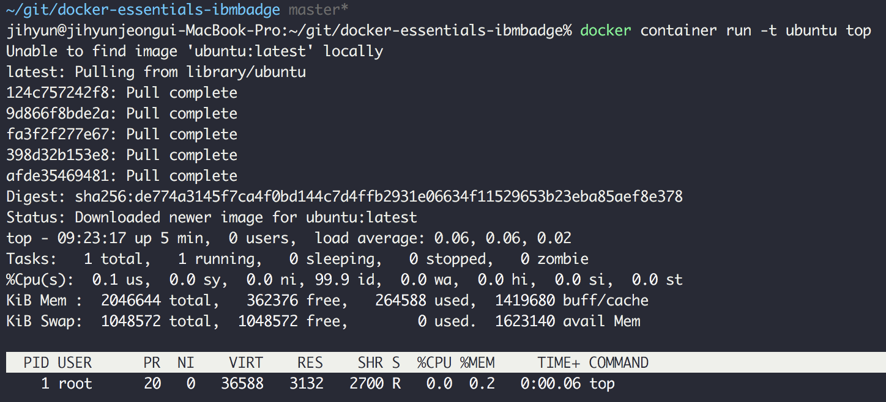

<h1 align="center">Docker Essentials: A Developer Introduction
</p>


# Get Started
Objectives
When you finish this course, you should understand:

* What containers are and their benefits
* How to find and run Docker containers from the Docker Hub
* How to create your first Docker container and understand the layering and union file system
* The best practices when developing Dockerfiles
* How to solve problems of orchestration: reconciliation, scaling, high availability, and service discovery
* Some of the tools that can help you run highly available applications in production, such as the IBM Container service

# Lab 1: Run your first container 
[Youtube - Lab 1 Overview](https://www.youtube.com/watch?time_continue=161&v=Mycr9j-jgYo)

## WHAT ARE CONTAINERS? 

* A group of processes run in isolation
    - All processes MUST be able to run on the shared kernel

* Each container has its own set of "namespaces"(isolated view)
    - PID: process IDs
    - USER: user and group IDs
    - UTS: hostname and domain name
    - NS mount points
    - NET: Network devices, stacks, ports
    - IPC: inter-process communications, message queues

* cgroups - controls limits and monitoring of resources

### VM vs Container


### What is Docker
* At its core, Docker is tooling to manage containers
    - Simplified existing technology to enable it for the masses
* Enable developers to use containers for their applications
    - Package dependencies with containers: "build once, run anywhere"

### Why Continers are Appealing to Users
* No more "Works on my machine"
* Lightweight and fast
* Better resource utilization
    - Can fit far more containers that VMs into a host
* Standard developer to operations interface
* Ecosystem and tooling

## Lab overview
* Containers are just a process (or a group of processes) running in isolation, which is achieved with Linux namespaces and control groups. Linux namespaces and control groups are features that are built into the Linux kernel. Other than the Linux kernel itself, there is nothing special about containers.

* What makes containers useful is the tooling that surrounds them. The labs in this course use Docker, which has been the understood standard tool for using containers to build applications. Docker provides developers and operators with a friendly interface to build, ship, and run containers on any environment.

* In the first part of this lab, run your first container, and learn how to inspect it. You will be able to witness the namespace isolation that you acquire from the Linux kernel.

* After you run your first container, you can explore other uses of docker containers. You can find many examples of these on the Docker Store and can run several different types of containers on the same host, which allows you to see the benefit of isolation—where you can run multiple containers on the same host without conflicts.

## Run a container

> 1. Open a terminal on your local computer and run this command: `docker container run -t ubuntu top`

You use the docker container run command to run a container with the Ubuntu image by using the top command. The -t flag allocates a pseudo-TTY, which you need for the top command to work correctly.

The docker run command first starts a docker pull to download the Ubuntu image onto your host. After it is downloaded, it will start the container. The output for the running container should look like this:

1. Install Docker

    - OS: MaC
    ```bash
    brew cask install docker
    ```
    - OS: Windows
    ```
    choco install docker-desktop
    ```
2. Running docker


3. run this command:

    ```bash
    docker container run -t ubuntu top

> The `docker run` command first starts a docker pull to download the Ubuntu image onto your host. After it is downloaded, it will start the container. The output for the running container should look like this:




* `top` is a Linux utility that prints the processes on a system and orders them by resource consumption. Notice that there is only a single process in this output: it is the `top` process itself. You don't see other processes from the host in this list because of the PID namespace isolation.

* Containers use Linux namespaces to provide isolation of system resources from other containers or the host. The PID namespace provides isolation for process IDs. If you run `top` while inside the container, you will notice that it shows the processes within the PID namespace of the container, which is much different than what you can see if you `ran` top on the host.

* Even though we are using the Ubuntu image, `it is important to note that the container does not have its own kernel`. It uses the kernel of the host and the Ubuntu image is used only to provide the file system and tools available on an Ubuntu system.

2. Inspect the container:
```
docker container exec
```
This command allows you to enter a running container's namespaces with a new process.


3. Open a new terminal. To open a new terminal connected to node1 by using Play-With-Docker.com, click `Add New Instance` on the left and then ssh from node2 into node1 by using the IP that is listed by node1, for example:

4. In the new terminal, get the ID of the running container that you just created:

```
docker container ls 
 ```
5. Use that container ID to run bash inside that container by using the docker container exec command. Because you are using bash and want to interact with this container from your terminal, use the -it flag to run using interactive mode while allocating a psuedo-terminal:

```
 docker container exec -it b3ad2a23fab3 bash 
root@b3ad2a23fab3:/#
```

6. From the same terminal, inspect the running processes:

```
ps -ef
```


7. For comparison, exit the container and run ps -ef or top on the host. These commands will work on Linux or Mac. For Windows, you can inspect the running processes by using tasklist.

```
root@b3ad2a23fab3:/# exit 
exit
$ ps -ef
# Lots of processes!
```
